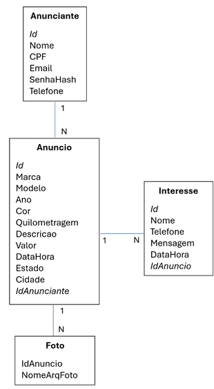

# Speed_Cars
Projeto final de Programação para Internet

Este trabalho tem como objetivo desenvolver um portal para a web especializado em anúncios de
veículos. O portal deve oferecer funcionalidades básicas para permitir que qualquer internauta possa se
cadastrar, efetuar login e anunciar seu veículo. Os últimos anúncios cadastrados devem ser listados na
página principal do portal, no formato de cards, sem a necessidade de login. Na página principal deve
haver campos do tipo select para que o internauta possa filtrar os resultados apresentados utilizando os
critérios marca, modelo e localização do veículo. O portal também deve permitir que um usuário
interessado em algum veículo possa deixar sua mensagem de interesse, a qual deve ser posteriormente
apresentada ao dono do anúncio quando ele fizer login no portal.

Todas as páginas do website devem possuir um layout contendo quatro partes bem definidas: um
cabeçalho, uma barra de navegação, um rodapé e uma parte principal para exibição de conteúdo. As
páginas de acesso público devem ser estilizadas sem utilizar o framework Bootstrap. Nas páginas da
área restrita, a utilização do Boostrap é opcional.

### A parte do portal voltada para o público em geral deve conter:
- [ ] Uma página principal para busca e exibição de anúncios de veículos;
- [ ] Uma página para visualização detalhada do veículo anunciado e registro de interesse;
- [ ] Uma página de login para que um usuário já cadastrado possa entrar e anunciar seu veículo;
- [ ] Uma página de cadastro para que um novo usuário (anunciante) possa se cadastrar no portal

### A parte do portal de acesso restrito deve conter telas/páginas para:
- [ ] Criação de novo anúncio de veículo;
- [ ] Listagem dos anúncios do usuário;
- [ ] Exclusão de anúncio (com respectiva exclusão das fotos);
- [ ] Visualização das mensagens de interesse deixadas pelos internautas;
- [ ] Exclusão das mensagens de interesse;

## Primeira Entrega

Para a primeira entrega, apenas as tecnologias HTML, CSS/Flexbox, JavaScript e Bootstrap devem ser
utilizadas. As páginas de cadastro, por exemplo, não precisam realizar nenhum armazenamento de
dados. As páginas de listagem de dados devem ser estáticas, com listagem de dados de exemplos, sem o
envolvimento de banco de dados.

### 2.1 Página Principal Externa (pública)
A equipe deverá criar um nome fictício para o portal de anúncios, assim como um logotipo, os quais
deverão ser exibidos na página principal utilizando um layout moderno e bem estruturado. A página
principal deverá exibir um painel de buscas com campos do tipo select para que o usuário possa
informar a marca do veículo de interesse, o modelo e a localização (cidade). Abaixo do painel de busca
deverão aparecer, no formato de cards, apenas os veículos anunciados que atendem aos critérios
informados pelo usuário. Para a primeira entrega não é necessário implementar efetivamente a
funcionalidade de busca, pois não haverá comunicação com banco de dados. Basta exibir uma lista
estática de cards de anúncios (cada card deve conter a marca, o modelo, o ano de fabricação, uma foto, a
cidade e o valor de venda do veículo anunciado).

### 2.2 Página de Cadastro de Usuário (anunciante)
O portal deve disponibilizar uma página contendo um formulário para cadastro de novos usuários. Os
seguintes dados devem ser cadastrados: nome, CPF, e-mail, senha e telefone.

### 2.3 Página de Login
Página contendo um formulário de login com os campos e-mail e senha para que um usuário que já
tenha se cadastrado possa logar e criar seus anúncios no sistema. A ação de logar em si só deve ser
implementada no sistema final.

### 2.4 Página de Registro de Interesse no Veículo Anunciado
Página para que um usuário interessado em um veículo anunciado possa deixar sua mensagem de
interesse no veículo. A página deve permitir que o usuário informe seu nome, telefone e a mensagem de
interesse propriamente dita.

### 2.5 Página Principal Interna (restrita)
Página principal da área restrita que será apresentada ao usuário depois que o login for realizado com
sucesso. Esta página deve conter links e/ou botões que dêem acesso às funcionalidades da parte restrita
como criação de novo anúncio, listagem dos anúncios criados etc. Deverá haver uma opção para que o
usuário realize logoff.

### 2.6 Página para Criação de Anúncio de Veículo (restrita)
Esta página deve conter um formulário que permita ao usuário criar novos anúncios de veículos. Os
dados a serem cadastrados são: marca do veículo, modelo, ano de fabricação, cor, quilometragem,
descrição, valor, estado (MG, SP, RJ etc.), cidade e fotos do veículo (pelo menos três).

### 2.7 Página de Listagem de Anúncios (restrita)
Esta página deve listar, de maneira resumida, todos os anúncios criados pelo usuário logado. Para cada
anúncio deverá ser apresentado uma foto do veículo, a marca, o modelo, o ano de fabricação, um
botão/link para visualização detalhada do anúncio, um botão/link para visualização dos interesses no
anúncio e um botão/link para exclusão do anúncio.

### 2.8 Página para Exibição Detalhada do Anúncio (restrita)
Quando o usuário clicar no link/botão de visualização detalhada do anúncio, na listagem anterior,
deverá ser apresentada uma página contendo todos os dados e fotos do respectivo veículo anúnciado.

### 2.9 Página de Listagem de Interesses (restrita)
Quando o usuário clicar no botão/link de visualização dos interesses do anúncio, na listagem anterior,
deverá ser apresentada uma página contendo todas as informações de todos os interesses registrados
pelos internautas no respectivo anúncio (nome, telefone e mensagem de interesse em si).

### 2.10 Entrega dos arquivos
Todos os integrantes da equipe devem enviar pelo sistema SAAT, até a primeira data de entrega, um
arquivo compactado contendo uma versão preliminar do portal, incluindo todas as páginas descritas
anteriormente. Deverá haver um arquivo de nome integrantes.txt contendo os nomes dos alunos e o
nome do portal.

---

# Entrega Final 
Os dados dos formulários de cadastro das páginas descritas anteriormente devem ser inseridos em um 
banco de dados MySQL, utilizando PHP, conforme o diagrama de dados apresentado a seguir. 
O back-end deve ser estruturado com base na arquitetura MVC. Classes apropriadas em PHP devem ser 
criadas utilizando como referência o exemplo ex3-cadastro-mvc do 10º trabalho semanal (Banco de 
Dados/MySQL/MVC Simplificado). Todas as requisições do front-end devem ser feitas a um script PHP 
que faça o papel de controlador. Se necessário, poderá haver um controlador para a parte restrita e outro 
para a parte pública. 

Toda a apresentação de dados do banco de dados deve ser feita por meio de atualização dinâmica da 
página web utilizando requisições Ajax, JavaScript e manipulação da árvore DOM. Os scripts PHP não 
devem produzir código HTML dinâmicamente. Ao invés, devem produzir saídas no formato JSON, as 
quais devem ser apresentadas na página utilizando JavaScript/Ajax.

---

## 3.1 Cadastro do Anunciante 
Os dados do formulário de cadastro de usuário devem ser inseridos na tabela anunciante do banco de 
dados. A senha não deve ser armazenada de forma clara na tabela. Apenas o código hash da senha deve 
ser armazenado, conforme apresentado no material de aula. 

## 3.2 Login 
A validação dos dados de login deve ser feita em segundo plano, com Ajax. Mensagens adequadas 
devem ser apresentadas caso os dados estejam incorretos. Para validar os dados de login utilize o campo 
E-mail da tabela Anunciante juntamente com o campo SenhaHash. 

O controle da sessão deve ser feito de maneira adequada, utilizando o conceito de sessões do PHP, de 
forma a impossibilitar o acesso às páginas restritas sem que o login tenha sido feito. A parte de acesso 
restrito deve ter um botão do tipo logoff/sair para que a sessão seja encerrada. 

## 3.3 Cadastro de Anúncio 
Os dados do formulário de criação de anúncio devem ser inseridos adequadamente na tabela anuncio 
do banco de dados, com o devido vínculo com o anunciante. As fotos do veículo anunciado devem ser 
renomeadas e armazenadas no servidor em uma subpasta do sistema. Apenas os nomes dos arquivos 
das fotos devem ser armazenados na tabela foto do banco de dados, com o devido vínculo com a tabela 
anuncio. A inserção nas tabelas anúncio e fotos deve ser feita utilizando o conceito de transação para 
evitar eventual cadastro parcial dos dados. 

O campo DataHora da tabela anuncio deve ser utilizado para armazenar a data e a hora em que o 
anúncio foi criado. Essa informação não deve ser solicitada ao usuário (pode-se utilizar a função now() 
do MySQL). 

Para permitir o envio de arquivos no formulário HTML utilize o atributo enctype no elemento <form> 
com o valor multipart/form-data. Para tratar o arquivo no servidor, veja o exemplo upload disponilizado 
nos códigos de exemplo PHP (https://furtado.prof.ufu.br/site/teaching/PPI/Exemplos-PHP.zip). 

## 3.4 Demais Páginas da Parte Restrita 
As demais páginas da parte restrita devem ser construídas de tal forma que as funcionalidades listadas 
na seção Descrição Geral deste documento sejam atendidas. 

## 3.5 Página Principal do Portal (pública) 
A página principal deverá exibir um painel de buscas com três campos do tipo select para que o usuário 
possa informar a marca do veículo desejado, o modelo e a localização (cidade). 

O campo select para seleção da marca deverá ser carregado dinamicamente com Ajax assim que a 
página principal for carregada. Deverão aparecer apenas as marcas dos veículos correntemente 
anunciados (veja o 11º trabalho semanal, exercício 7). Não devem aparecer valores duplicados. 
O campo select para seleção do modelo deverá ser carregado dinamicamente com Ajax assim que o 
usuário selecionar a marca. Apenas os modelos de veículos correntemente anunciados, da referida 
marca, deverão aparecer no select. Não devem aparecer valores duplicados.

O campo select para seleção da localização do veículo também deve ser carregado dinamicamente com 
Ajax. As localizações devem aparecer assim que o usuário selecionar o modelo. O campo deve ser 
carregado com apenas os nomes das cidades referentes aos anúncios da marca e modelo escolhidos. Não 
devem aparecer valores duplicados. 

Abaixo do painel de buscas deverão aparecer, no formato de cards, os últimos 20 anúncios de veículos 
criados que atendem aos critérios informados pelo usuário (não há necessidade de fazer paginação ou 
exibir mais de 20 resultados). A utilização dos filtros de busca não deve ser obrigatória. Por exemplo, se 
o usuário não selecionar nada, deverão aparecer os últimos 20 anúncios cadastrados, independemente 
de marca, modelo e localização, com o último anúncio cadastrado aparecendo no topo da listagem. Se o 
usuário selecionar apenas a marca então deverão ser listados os últimos 20 anúncios de veículos daquela 
marca, podendo incluir veículos de vários modelos da marca. 
Os parâmetros da busca devem ser enviados ao servidor por meio de uma requisição Ajax e os 
resultados devem ser exibidos por meio de atualização dinâmica da página com JavaScript, sem efetuar 
um recarregamento completo ou redirecionamento. O servidor deve retornar sempre os resultados no 
formato JSON. 

## 3.6 Entrega 
O sistema completo deve ser colocado online até a segunda data de entrega indicada no início deste 
documento. Recomenda-se o registro de um nome de domínio apropriado para o portal de anúncios (há 
nomes de domínios a partir de R$ 5,00), com respectivo redirecionamento para o subdomínio gratuito 
onde o website é efetivamente hospedado. Como alternativa, pode-se registrar um novo subdomínio 
gratuito no infinityfree, com nome apropriado para o portal de anúncios. O endereço de acesso deve ser 
conciso e direto como meuportaldeveiculos.dominio.com. A necessidade de incluir nomes de pastas e 
arquivos para acesso (como em meuportal.domino.com/trabalho-final/home.html) acarretará em perda 
de nota por questões de usabilidade. 
Além da disponibilização online, também é necessário compactar a pasta raiz do sistema web (contendo 
todos os arquivos e recursos necessários para o seu funcionamento) e enviar o arquivo compactado, até a 
data limite de entrega, pelo sistema SAAT. O arquivo compactado não deve ultrapassar o limite de 10 
MB. Se necessário, reduza a resolução das imagens, figuras etc. 
Na versão entregue ao professor, a equipe deverá incluir, na pasta raiz, os seguintes arquivos de texto: 
• Arquivo tabelas.sql contendo o código SQL necessário para criação das tabelas do BD; 
• Arquivo integrantes.txt contendo os nomes dos membros da equipe; 
• Arquivo endereço.txt contendo o nome do portal de anúncios e a URL de acesso online. 

